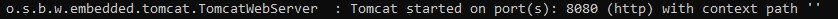
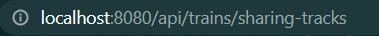

# 01_Proyek_Informatika

## Anggota Kelompok B :

- Nadia Clarissa Hermawan        6181901013
- Reynaldi Lukas Yudawinata      6181901038
- Thomas Christsian Haeryono     2016730027

## Project Details :
This is a Spring-boot REST API project for a train management application as explained by a challenge from [Topcoder](https://www.topcoder.com/challenges/a840efcb-eaf4-435f-92d8-0fbde7dfa018) website.

In this [Topcoder](https://www.topcoder.com/challenges/a840efcb-eaf4-435f-92d8-0fbde7dfa018) page, there are 3 types of difficulty for this challenge. The difficulties are as following: 
- Childhood Dream (easy) -  http://www.topcoder.com/challenges/30168991
- Bullet Train (medium) - http://www.topcoder.com/challenges/30168980 
- Old Train (hard) - http://www.topcoder.com/challenges/30168986

The reference that is being used to work on this project comes from this [link](https://www.bezkoder.com/spring-boot-postgresql-example/)

## Software & Environment Requirement :
- JDK 8
- Spring Boot 2 (with Spring Web MVC, Spring Data JPA)
- PostgreSQL
- Maven

## How To Run the Project:
### 1. Preconditions:
1. Make sure the JDK 8 bin and Maven bin directory is in the System Variables Path. If they're not there, then create new System Variable Path towards JDK 8 bin and Maven bin.
2. Make sure you have a variable named JAVA_HOME, containing JDK 8 bin directory, and variables named MAVEN_HOME and M2_HOME containing maven directory. If you don't have the mentioned variables, then create one with their respective directory values.
2. Open [db/query.sql](https://github.com/NadiaClarissaHermawan/01_Proyek_Informatika/blob/master/db/query.sql) in the db folder. Copy and paste all the commands there into psql. 
3. Customize the datasource.url, datasource.username, and datasource.password value in the application.properties according to your own database.
These are the directories of the application.properties for each difficulty levels:
 - Childhood dream (easy): [childhooddream/src/main/resources/application.properties](https://github.com/NadiaClarissaHermawan/01_Proyek_Informatika/blob/master/childhooddream/src/main/resources/application.properties)
  - Bullet train (medium): [bullettrain/src/main/resources/application.properties](https://github.com/NadiaClarissaHermawan/01_Proyek_Informatika/blob/master/bullettrain/src/main/resources/application.properties)
  - Old train (hard): [oldtrain/src/main/resources/application.properties](https://github.com/NadiaClarissaHermawan/01_Proyek_Informatika/blob/master/oldtrain/src/main/resources/application.properties)

### 2. How To Activate the API :

1. Open the project directory in cmd
2. Type mvn spring-boot:run 
3. Enter & wait 

## How to use the API:

1. Once you've run the spring-boot, check the port where your TomcatWebServer started
For example: 

2. You can then use the endpoints from this API according to the endpoints explained in the Topcoder challenge respective to their difficulty levels.
<!--refer balik ke section difficulty-->
 ### Childhood Dream (easy difficulty)
 1. Endpoint to view all trains 
    - Method: GET
    - Url: /api/trains/
    - Response: 
      - Success:
        - Returns 200 code and
        - Returns all trains with all keys and values
      - Error:
        - Returns 405 code with "invalid endpoint" message
 2. Endpoint to view train detail by id
    - Method : GET
    - Url : /api/trains/:id
    - Response:
      - Success:
        - Returns 200 code and
        - Returns the details of selected train by id
      - Error: 
        - When the train searched by id don't exist:
          - Returns 404 code and "train not found" message
 ### Bullet Train (medium difficulty)
 1. Endpoint to view all trains 
    - Method: GET
    - Url: /api/trains/sharing-tracks
    - Response: 
      - Success:
        - Returns 200 code and
        - Returns list of all train with their sharing-tracks value being true
      - Error:
        - When search with incorrect route for example:  /api/trains/distance-between-stop
          - Returns 405 code and "invalid endpoint" message
 2. Endpoint to view all trains 
    - Method: GET
    - Url: /api/trains?amenities=\[keyword\]
    - Response: 
      - Success:
        - Returns 200 code and
        - Returns list of all train that contains the keyword in their amenities attribute 
      - Error:
        - When use other parameters than the amenities
          - Returns 405 code and "invalid endpoint" message
        - When search result empty
          - Returns 200 code and "train not found" message
3. Endpoint to delete a train
   - Method: DELETE
   - Url: /api/trains/:id
   - Response: 
     - Success:
       - Returns 200 code and "train removed successfully" message
     - Error:
       - If searched train don't exist:
         - Returns 404 code and "train not found" message
### Old Train (hard difficulty)
1. Endpoint to edit existing train by id
   - Method: PUT
   - Url: /api/trains/:id
   - Body request needed:
     - name: String
     - description: String
     - distance-between-stop: String
     - max-speed: String
     - sharing-tracks: Boolean
     - grade-crossing: Boolean
     - train-frequency: String
     - amenities: String
   - Response: 
     - Success:
       - Returns 200 code and "train edited successfully" message
     - Error:
       - If searched train don't exist:
         - Returns 404 code and "train not found" message
       - When filled with different data types for example: id, sharing-tracks or grade-crossing with other values than boolean:
         - Returns 404 code and "failed when edit train" message
2. Endpoint to create a new train
   - Method: POST
   - Url: /api/trains/
   - Sample body request data to add a new train:
   <pre>
    {
    "id": 6,
    "name": "Eurostar e320",
    "description": "Eurostar e320 was created as a single and unified corporate entity owned by SNCF, SNCB and LCR in September 2010. In December, a £700m (approximately $1,076bn) investment to add ten new e320 trains to its fleet and carry out a complete upgrade of its existing 28 trains. It is capable of carrying more than 900 passengers as a result of the 20% capacity boost given to it, compared to the existing 28 Eurostar trains which carry 750 passengers. The entire propulsion system and technical modules are distributed under the floor over the entire length of the train, providing more space for passengers. The train’s roof is equipped with eight pantographs for dealing with Europe’s different power systems and contact line types.",
    "amenities": "Restroom, business class, cafe car, Wi-Fi, Onboard flat-screens. Reclining seats, flexible reading lamp, a sliding dining table and more luggage areas. Four spaces are provided for wheelchair passengers.",
    "distance-between-stop": "at least 200 miles",
    "max-speed": "200 mph",
    "sharing-tracks": false,
    "grade-crossing": false,
    "train-frequency": "12 hours"
    }
   </pre>
   - **Important**: Please assume all keys and values are required for POST method and must use the correct data type.
   - Response: 
     - Success:
       - Returns 201 code and "new train added successfully" message
     - Error:
       - When add fields and values that not exists, for example:
        <pre>
        "id": 11,
        "name-new": "name ODD",
        "description-new": "description ODD",
        returns 400 code and "failed validation" message
        </pre>
   - Example:

  
## How to Kill Task :

### Method 1
1. Open cmd, type : netstat -ano | findstr 8080
2. type : taskkill /F /PID "task_id"

### Method 2
1. Open cmd, type: ctrl+c, then press enter
2. when prompted, type y, then press enter
